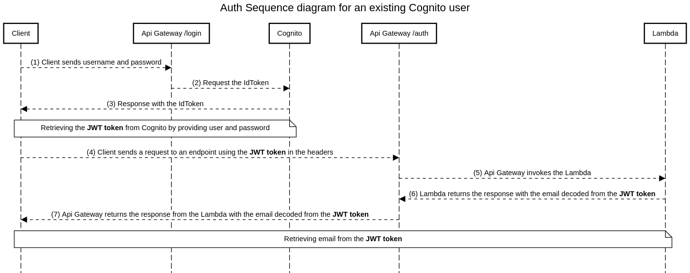

Api Gateway endpoint that is authenticated against a Cognito User Pool and it's pointing to a Lambda that decodes the JWT received from Cognito at authentication and returns the email of the Cognito user.

Example:
1. take a look at [config.py](config.py) and update it accordingly 
2. run the [create_user.py](create_user.py) to create a new Cognito user
```python
python ./create_user.py 
{'User': {'Username': '4e13a754-28d3-4e67-a08e-5ce0c6fae306', 'Attributes': [{'Name': 'sub', 'Value': '4e13a754-28d3-4e67-a08e-5ce0c6fae306'}, {'Name': 'email', 'Value': 'lucian@example.com'}], 'UserCreateDate': datetime.datetime(2022, 1, 21, 16, 33, 51, 979000, tzinfo=tzlocal()), 'UserLastModifiedDate': datetime.datetime(2022, 1, 21, 16, 33, 51, 979000, tzinfo=tzlocal()), 'Enabled': True, 'UserStatus': 'FORCE_CHANGE_PASSWORD'}, 'ResponseMetadata': {'RequestId': 'abd2d63c-a1b7-4cc8-a31c-a476f81c68fc', 'HTTPStatusCode': 200, 'HTTPHeaders': {'date': 'Fri, 21 Jan 2022 14:33:52 GMT', 'content-type': 'application/x-amz-json-1.1', 'content-length': '309', 'connection': 'keep-alive', 'x-amzn-requestid': 'abd2d63c-a1b7-4cc8-a31c-a476f81c68fc'}, 'RetryAttempts': 0}}
{'ResponseMetadata': {'RequestId': '998cfb37-087d-4c84-bd8c-5d7c6d0add14', 'HTTPStatusCode': 200, 'HTTPHeaders': {'date': 'Fri, 21 Jan 2022 14:33:52 GMT', 'content-type': 'application/x-amz-json-1.1', 'content-length': '2', 'connection': 'keep-alive', 'x-amzn-requestid': '998cfb37-087d-4c84-bd8c-5d7c6d0add14'}, 'RetryAttempts': 0}}
```

3. run [login.py](login.py) to retrieve the JWT token from Cognito
```python
python ./login.py 
eyJraWQiO...
```
4. execute 
```bash
curl -X GET 'https://rkwq3kbkx4.execute-api.eu-west-1.amazonaws.com/test' -H 'Authorization: eyJraWQiO...'
{"response": {"resultStatus": "SUCCESS", "results": {"email": "lucian@example.com"}}}
```

Details:

[login.py](login.py) contains the solution for authenticating against Cognito User Pool with user and password (WITHOUT secret)
Requirements:
- Cognito User Pool
- IAM access with permissions to Cognito (AWS keys)
- [Cognito App client](App_client.png) without App client secret or with App client secret, but then the 'app_client_secret' variable from config.py must be set 
- Auth Flows Configuration enabled for all
- [Cognito App client settings](App_client_settings.png) with Sign in and sign out URLs, Authorization code grant
- Allowed OAuth Scopes email and openid
- Domain name
- [Api Gateway Authorizer](api_gw_authorizers.png) pointing to Cognito User Pool


[cognito.txt](cognito.txt) sequence diagram was generated from https://sequencediagram.org/
